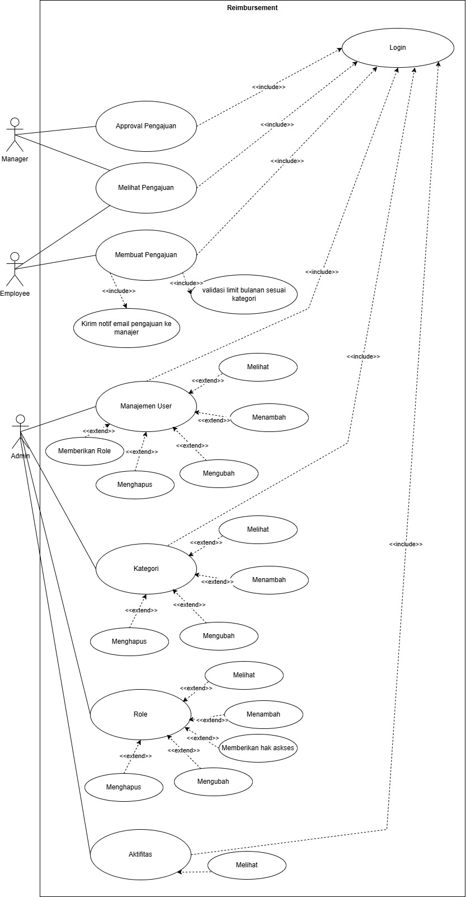
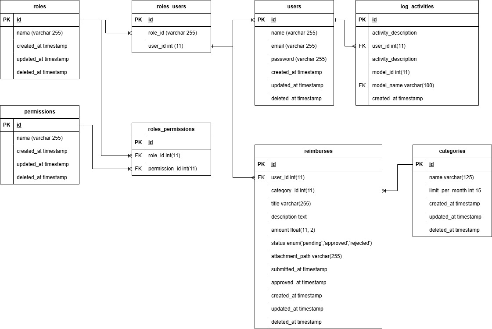
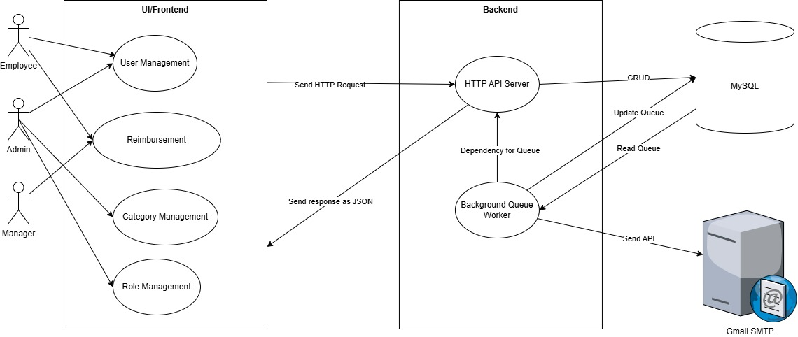

For Indonesian documentation, see [docs/README_IDN.md](docs/README_ID.md) 

# Employee Reimbursement Management System

A reimbursement management application for employees built using Laravel 12 (backend) and Nuxt.js 3 (frontend).

---

## Prerequisites

Before starting, ensure your system meets the following requirements:

* **PHP** version **8.3**
  Install: [php.net/downloads.php](https://www.php.net/downloads.php)
* **Node.js** version **v20** or higher
  Install: [nodejs.org/en/download](https://nodejs.org/en/download/)
* **PNPM** as the package manager (do not use npm)
  Install: [pnpm.io/installation](https://pnpm.io/installation)
* **MySQL Database**
  Install MySQL: [dev.mysql.com/downloads](https://dev.mysql.com/downloads/)
* **(Windows/Mac) Laragon or XAMPP** — recommended for easier PHP & MySQL setup

  * Laragon: [laragon.org](https://laragon.org/)
  * XAMPP: [apachefriends.org](https://www.apachefriends.org/index.html)

---

## Workflow & Architecture Diagrams

### Use Case Diagram



### Entity Relationship Diagram



### Architecture Diagram



* **Frontend**: Nuxt.js serves as the user interface and consumes backend APIs.
* **Backend**: Laravel provides RESTful APIs, handles business processes, communicates with the database, and integrates with third-party services (e.g., email notifications).
* **Database**: MySQL stores all backend data.

---

## Design & Approach

* **Role Management**: Utilizes the Spatie Laravel Permission package to manage roles (admin, manager, employee) and permissions. It's battle-tested and production-proven.

* **Monthly Limit Validation**: On submission, the backend checks the total reimbursements submitted per category in the current month (`limit_per_month`) and rejects any that exceed the limit.

* **Transaction Proof Upload**: Supports PDF/JPG format up to 2MB. Files are stored in Laravel's filesystem (`storage/app/public`) and the path is saved in the database.

* **Approval Flow**:

  1. Employee submits a reimbursement request.
  2. Manager approves or rejects the request.

* **Soft Deletes**: The `Reimbursement` model uses the `SoftDeletes` trait. Deleted records remain in the database and can be viewed using `withTrashed()`.

* **Activity Logging**: Uses the Spatie Activitylog package to record actions such as "submission" and "approval" of reimbursements.

* **Asynchronous Email Notifications**: Leverages Laravel Queue (database driver) to send emails to managers via Gmail SMTP or another email provider.

---

## Key Features

1. **Authentication**
2. **Role Management**
3. **Reimbursement Management** (submission, approval, deletion)
4. **User Management**
5. **Category Management**
6. **Activity Logging**
7. **Email Notifications** via queue

---

## Demo

You can try the live demo here (accessible via browser):

**[http://reimbursement.genstail24.my.id](http://reimbursement.genstail24.my.id)**  
> **Note:** Make sure to use `http://` (not `https://`) as the site does not support HTTPS.

---

## Setup & Deployment

### A. Manual Setup (Single Repository)

#### 1. Clone the Repository

```bash
git clone https://github.com/genstail24/reimbursement-system.git reimbursement-system
cd reimbursement-system
```

#### 2. Backend (Laravel 12)

1. Navigate to the backend directory:

   ```bash
   cd backend
   ```

2. Install dependencies:

   ```bash
   composer install
   ```

3. Create the environment file:

   ```bash
   cp .env.example .env
   ```

4. Configure `.env` according to your setup (SMTP, MySQL, app URL):

   ```dotenv
   APP_NAME="ReimbursementSystem"
   APP_URL=http://localhost:8000           # Backend URL
   APP_FRONTEND_URL=http://localhost:3000  # Frontend URL

   DB_CONNECTION=mysql
   DB_HOST=127.0.0.1
   DB_PORT=3306
   DB_DATABASE=your_database_name
   DB_USERNAME=your_db_username
   DB_PASSWORD=your_db_password

   QUEUE_CONNECTION=database

   MAIL_MAILER=smtp
   MAIL_HOST=smtp.mailtrap.io              # adjust accordingly
   MAIL_PORT=2525
   MAIL_USERNAME=…
   MAIL_PASSWORD=…
   MAIL_FROM_ADDRESS=hello@example.com
   MAIL_FROM_NAME="Reimbursement System"
   ```

5. Generate the application key:

   ```bash
   php artisan key:generate
   ```

6. Run database migrations and seeders:

   ```bash
   php artisan migrate --seed
   ```

7. Create symbolic link for storage:

   ```bash
   php artisan storage:link
   ```

8. Start the queue worker in a separate terminal:

   ```bash
   php artisan queue:work
   ```

9. Start the development server:

   ```bash
   php artisan serve
   ```

#### 3. Frontend (Nuxt.js 3)

1. Open a new terminal and go to the frontend directory:

   ```bash
   cd reimbursement-system/frontend
   ```

2. Install dependencies using PNPM:

   ```bash
   pnpm install
   ```

3. Create the environment file:

   ```bash
   cp .env.example .env
   ```

4. Configure `.env` (make sure `API_BASE_URL` points to the backend):

   ```dotenv
   NUXT_PUBLIC_API_BASE_URL=http://localhost:8000/api
   ```

5. Start the development server:

   ```bash
   pnpm run dev
   ```

6. Open the app in your browser:

   ```
   http://localhost:3000
   ```

### B. Monorepo Setup (Lerna)

> **! Not Yet Implemented**
> Monorepo structure using Lerna is still under development.

---

## USER LOGIN

| Name           | Email                  | Password  | Role     |
|----------------|------------------------|-----------|----------|
| Admin          | admin@example.com      | password  | admin    |
| Manager One    | manager@example.com    | password  | manager  |
| Manager Two    | managerTwo@example.com | password  | manager  |
| Employee One   | employee1@example.com  | password  | employee |
| Employee Two   | employee2@example.com  | password  | employee |
| Employee Three | employee3@example.com  | password  | employee |

---

## API Documentation

* **Postman Collection**: [docs/Reimbursement_API_Collection.postman_collection](docs/Reimbursement_API_Collection.postman_collection) (import this into Postman to test endpoints)

---

## Challenges & Solutions

Overall, with my experience, I did not face any significant challenges in the technical design or implementation of the backend and frontend.

